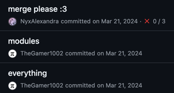
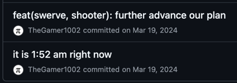
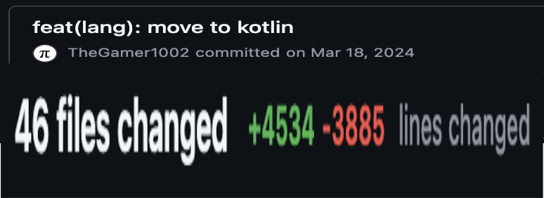
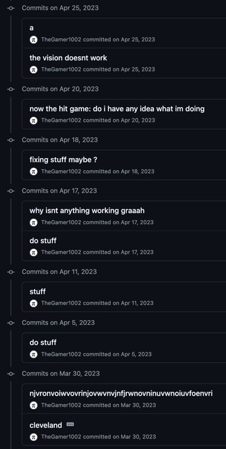

## Contributing
### Git Setup
To contribute to this project, you will need Git,
a GitHub account, a terminal, and a little patience.
1. **Create a GitHub account**:
    - Go to [GitHub](https://github.com) and create an account.
    - It is recommended to use your school email address to make gaining student benefits easier.
2. **Install Git and GitHub CLI**:
    - Download and install Git from the [official website](https://git-scm.com), as well as the
      [GitHub CLI](https://cli.github.com).
    - Follow the instructions for your operating system.
> [!NOTE]
> Package managers are a great way to install the various bits and bobs you need.
> On Windows,
> you can use [WinGet](https://learn.microsoft.com/en-us/windows/package-manager/winget/),
> [Homebrew](https://brew.sh) on macOS,
> and apt/pacman/yum/dnf/whatever Nix has going on/*insert package manager here* on Linux.
> (If you're on Linux, chances are you know how to use a package manager.)
>
> The packages you need should be named `git` and some variant of `github-cli`.

3. **Set up Git**:
    - Open a terminal and run the following command:
    ```sh
    gh auth login
   ```
    - Follow the prompts to authenticate with GitHub.
        - You will need to authenticate with your browser.
        - Use the default settings for the authentication process, and make sure you have it set up your git configuration automatically.
### Git: a lesson in version control
Git is a version control system that allows you to track changes to files over time.
This is *really important* when working on a project with multiple people,
or with a bunch of moving parts (like a robot).
<small><s>It also makes it easier to pin blame on someone when something breaks</s></small>

Git has a few key concepts:
- **Repository**: A repository, or repo, is a collection of files and folders that make up a project.
- **Commit**: A commit is a snapshot of the repository at a given point in time.
- **Branch**: A branch is a parallel version of the repository that allows you to work on features or fixes without affecting the main codebase.

Additionally, GitHub adds a few more concepts:
- **Fork**: A fork is a copy of a repository that you can modify without affecting the original.
- **Pull Request**: A pull request, or PR, is a request to merge changes from one branch into another.
- **Issue**: An issue is a task, bug, or feature request that can be assigned, commented on, and closed.

#### How to actually do stuff correctly
If you've seen some of our previous codebases, you'll notice some of them are a bit of a mess.
Here's some screenshots of egregious examples.
<details>
<summary>read at your own risk</summary><br>
<div style="text-align: center; margin: auto;">
<br>
<br>
<br>
<br>
<br>
<i>You get the idea.</i></div><br>
</details>


In case it isn't obvious, this is not how you should be using Git.
So,
we're adhering to something
called [Conventionial Commits](https://www.conventionalcommits.org/en/v1.0.0/).
In essence, it's a way to write commit messages that are easy to read and understand.
> [!IMPORTANT]
> This is essential reading.
> It's much easier to spend the few seconds
> to write a good commit message than to spend hours trying to figure out what you did,
> and then spend even more time manually going back and changing all the commit messages.

We're also extending the concept of conventional commits to our branch names.
If you take a peek,
you'll see that our branches are named like `feat/vision/akit` or `fix/gradle/typo`.
We encourage you to do the same.

Another important thing to do is to make sure your commits are specific.
Don't make one huge commit that changes everything.
Instead, make smaller commits that have specific scopes.
If you do find yourself with a bunch of changes, you can select individual files to commit,
and you can even commit individual lines of code.

### Alright, cool, but how do I actually do stuff?
After you've followed the steps above, as well as the steps in the README, you should be ready to start contributing.
0. **Make sure you have write access to the repository**:
    - If you don't have write access, you can fork the repository and make changes there.
      - If you think you should have write access, talk to whoever's in charge of the programming team.
    - If you do have write access, you can skip this step.
1. **Crank some code**:
    - Make your changes.
    - Make sure your changes are tested and work as expected.
> [!NOTE]
> The steps diverge here depending on whether you're using IntelliJ IDEA or the command line.
> The rest of the steps will focus on IntelliJ IDEA.
> For the command line, you'll probably want to make a new branch *before* you start making changes.
> ```sh
> git switch -c feat/your-feature-name
> ```
2. **Commit your changes**:
    - Open the Git tool window in IntelliJ IDEA.
    - Select the files you want to commit.
    - Write a commit message that follows the [Conventional Commits](https://www.conventionalcommits.org/en/v1.0.0/) standard.
    - Click the commit button.
3. **Push your changes to a new branch**:
    - Click the Git dropdown in the top left of the window (it's to the right of the project switcher dropdown).
    - Click "Push...".
    - You should see something that looks like `main -> origin: main`. Click the last `main` part in the sentence and change it to the name of your branch, using the Conventionial Commits format (`keyword/scope/description`).
    - Click "Push". This will push your changes to a new branch on the remote repository.
    - If you'd like to open a pull request, click the "Create Pull Request" button in the notification that appears in the bottom right. Write a description of your changes and click "Create".